# Proyecto de Administración de Servicios en Red

Este repositorio contiene toda la configuración necesaria para desplegar este proyecto. 

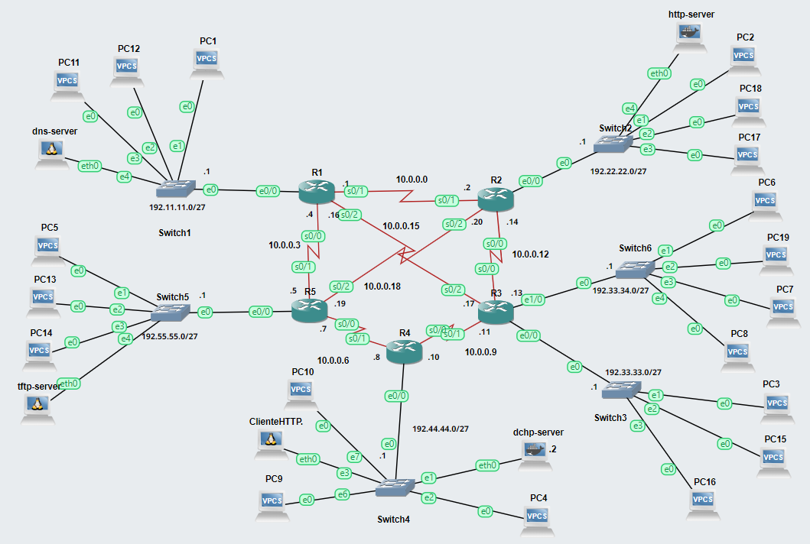

Para este proyecto se requiere de:
- [Microsoft Azure for Students](https://azure.microsoft.com/en-es/free/students/)
- [GNS3](https://gns3.com/)
- [Docker](https://www.docker.com/)

Esta guia es una alternativa a instalar la máquina virtual de GNS3 en nuestra computadora local, ya que utilizaremos los recursos de una máquina virtual de Azure.

## Creación del servidor remoto de GNS3 una máquina virtual en Azure

1. Crear una máquina virtual en Azure con **Ubuntu** mínimo con 2 vCPU, 4 GB de RAM y un disco HDD (para disminuir costos)

    - Para más información ver este [video](https://www.youtube.com/watch?v=ZU0nL8Y1FhI)
    - Asegurarse de guardar la contraseña y usuario de la máquina virtual

2. Configurar el DNS name con una **IP estática** de nuestra máquina virtual
    - Esto es necesario para poder usar el servidor desde el cliente de GNS3
    - Para más información ver este [video](https://www.youtube.com/watch?v=M_AbXiO-flE)

      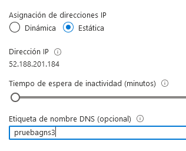

3. Abrir el **puerto 3080** de la máquina virtual para el **protocolo TCP** con un **Origen y Destino cualquiera**
    - Para más información ver este [video](https://www.youtube.com/watch?v=XhfrZr3Y4dc)  

      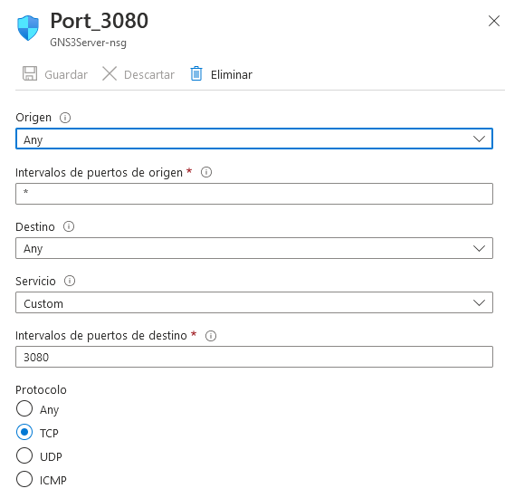

4. Entrar a la máquina virtual usando el protocolo SSH 

    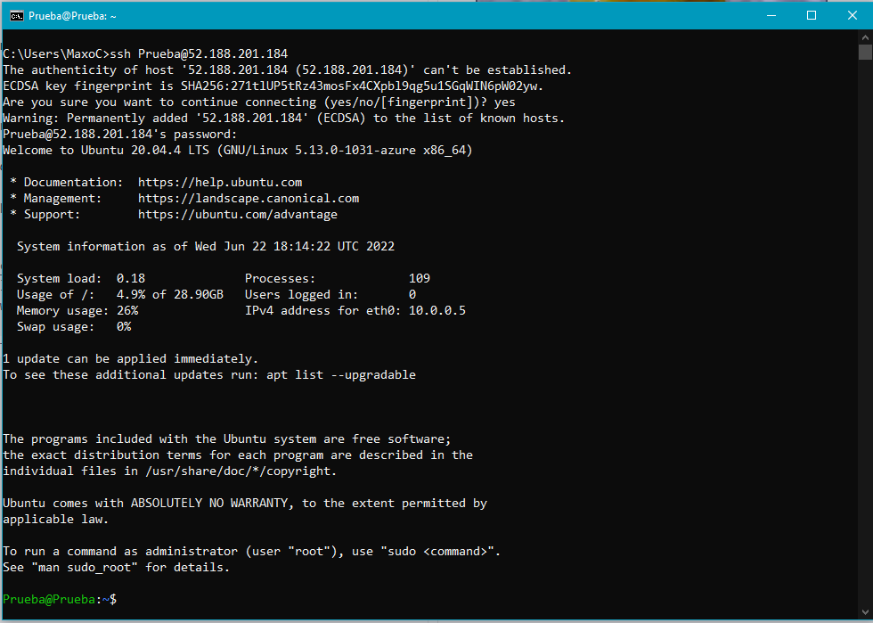

5. Escribir los siguientes comandos para instalar GNS3 en la máquina virtual
    > cd /tmp  
    curl https://raw.githubusercontent.com/GNS3/gns3-server/master/scripts/remote-install.sh > gns3-remote-install.sh  
    sudo bash gns3-remote-install.sh --with-iou --with-i386-repository  

**Este proceso solo creará el servidor de GNS3 y se requiere tener un cliente instalado en una computadora local para usarlo**

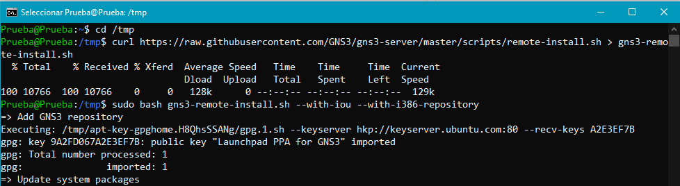

**Apagar la máquina virtual cada vez que se termine de trabajar, esto es unicamente para ahorrar el crédito de la cuenta de Azure**

## Configuración del cliente de GNS3 

1. Abrir la ventana de prefencias del cliente de GNS3 y ubicar el apartado de **Server > Main Server** 

    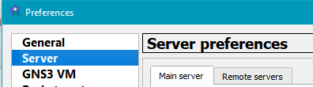

2. Llenar los siguientes campos con la información de nuestra máquina virtual

    > Desmarcar la casilla de **Enable local server** (esto es para usar los recursos de nuestra máquina virtual)  
    **Protocol:** HTTP  
    **Host:** DNS name de nuestra máquina local  
    **Port:** 3080 TCP  
    Marcar la casilla de **Auth**  
    **User:** Nombre de usuario de nuesta máquina virtual  
    **Password:** Contraseña de nuestra máquina virtual   

    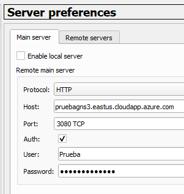

**Si les muestra un mensaje de error como el siguiente, es más sencillo actualizar a una nueva versión del cliente de GNS3**

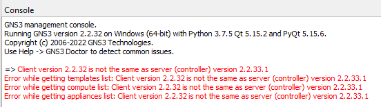

## Creación del proyecto

El modelo de switch que se utilizó para este proyecto fue el C2600 (la imagen se puede encontrar en la carpeta **Recursos** de este mismo repositorio, así como los demás appliances usados)

1. Importar los appliances necesarios. Este [video](https://www.youtube.com/watch?v=ziekiAImEgw) explica como hacerlo
2. Armar la topología mostrada al principio del documento o cualquier otra
3. Conectar los dispositivos, asignar direcciones IPv4 a todos los enlaces y utilizar cualquier enrutamiento deseado (**este proyecto utiliza RIP versión 2**)
4. Comprobar que se puede hacer ping desde cualquier router

**Asegurarse de guardar la configuración de los routers con el comando `do wr` antes de apagar la máquina virtual ya que sino se hace, toda la configuración se borrará**

## Asignación de IPv4 estática

1. En el archivo `/etc/network/interface` de cualquier contenedor Docker con **Ubuntu** descomentar la configuración de `eth0` o cualquier otra y asignar una **dirección IPv4, una submáscara de red, gateway y nameserver** como se muestra a continuación

    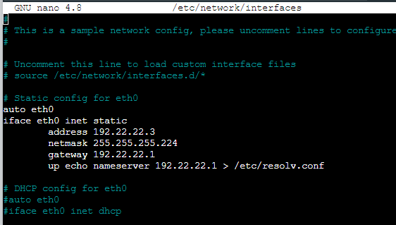
    
    **La configuración restante se deja comentada, en caso de querer usar el servidor DHCP descomentar la sección correspondiente (la de más abajo)**

2. Para comprobar la configuración ejecutar el comando `ifconfig` o `ip add`, esto depende de la appliance o del contenedor de Docker

    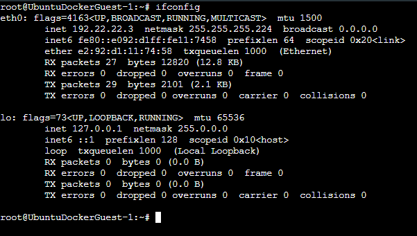

    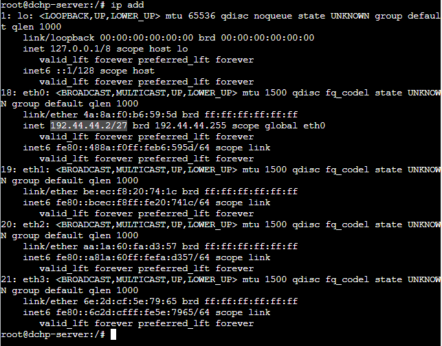

**En caso de que la configuración falle solo basta con reiniciar el servidor**

## Implementación de los servicios

En este proyecto se desplegaron 4 servicios los cuales son: DHCP, DNS, TFTP y HTTP.

### DHCP
1. Crear una carpeta dentro de nuestra máquina virtual llamada DHCP
2. Crear un archivo llamado Dockerfile dentro de la carpeta que acabamos de crear
3. Pegar la siguiente configuración en el archivo

    > FROM ubuntu  
    RUN apt update  
    RUN apt install nano  
    RUN apt install iputils-ping -y  
    RUN apt install iproute2 -y  
    RUN apt install isc-dhcp-server -y  

4. Crear la imagen con el siguiente comando `sudo docker build -t nueva-imagen .`

    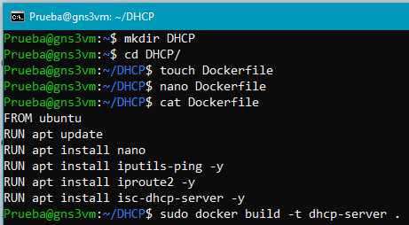

5. En el archivo `/etc/dhcp/dhcp.conf` descomentar la linea `authoritative;`

    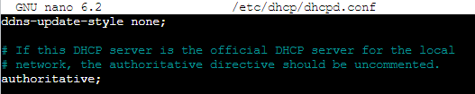

6. En el mismo archivo colocar la siguiente configuración (valido para este proyecto)

    > subnet 192.11.11.0 netmask 255.255.255.224 {  
        range 192.11.11.3 192.11.11.15;  
        option routers 192.11.11.1;  
        option subnet-mask 255.255.255.224;  
        option broadcast-address 192.11.11.255;  
    }  
    subnet 192.22.22.0 netmask 255.255.255.224 {  
        range 192.22.22.3 192.22.22.15;  
        option routers 192.22.22.1;  
        option subnet-mask 255.255.255.224;  
        option broadcast-address 192.22.22.255;  
    }   
    subnet 192.33.33.0 netmask 255.255.255.224 {  
        range 192.33.33.3 192.33.33.15;  
        option routers 192.33.33.1;  
        option subnet-mask 255.255.255.224;  
        option broadcast-address 192.33.33.255;  
    }  
    subnet 192.44.44.0 netmask 255.255.255.224 {  
        range 192.44.44.3 192.44.44.15;  
        option routers 192.44.44.1;  
        option subnet-mask 255.255.255.224;  
        option broadcast-address 192.44.44.255;  
    }  
    subnet 192.55.55.0 netmask 255.255.255.224 {  
        range 192.55.55.3 192.55.55.15;  
        option routers 192.55.55.1;  
        option subnet-mask 255.255.255.224;  
        option broadcast-address 192.55.55.255;  
    }  

7. En el archivo `/etc/default/isc-dhcp-server` configurar la interfaz conectada al router de la siguiente forma

    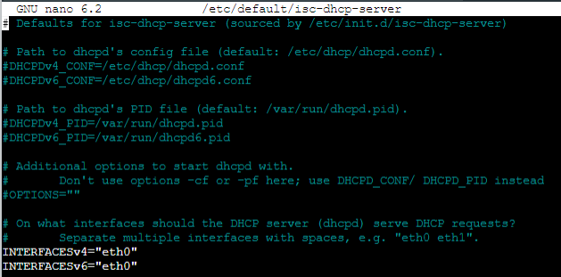

8. Para encender el servidor ejecutamos el comando `service isc-dhcp-server start` desde la consola del cliente de GNS3

    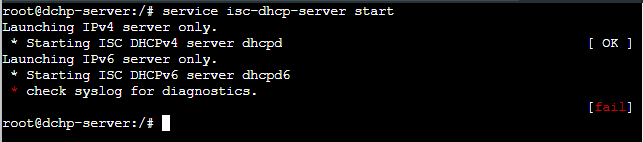

**Con el comando `sudo docker ps` se pueden ver los contenedores de Docker corriendo en nuestro proyecto**

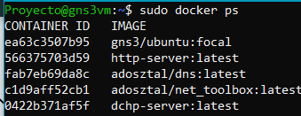

### DNS
Se utilizo el appliance [dns](https://gns3.com/marketplace/appliances/dns) del marketplace de GN3, también se puede encontrar en la carpeta **Recursos** de este repositorio

1. Importar el appliance
2. Asignarle una dirección estatica al servidor
3. Agregar la siguiente configuración en el archivo `/etc/hosts` (configuración valida para este proyecto)

    > 192.11.11.2 dnsserver.lab dnsserver  
    192.22.22.2 dnsserver.lab dnsserver  
    192.44.44.2 dhcpserver.lab dhcpserver  
    192.55.55.2 tftpserver.lab tftpserver  

Para una explicación más amplia ver estos videos: [parte 1](https://www.youtube.com/watch?v=86MIuxQ-LtI&t) y [parte 2](https://www.youtube.com/watch?v=sTEKHzfX5Fc)

**En caso de que el servidor no funcione correctamente se deberá reiniciar con el siguiente comando `service dnsmasq restart`**

### TFTP
Se utilizo el appliance [net-toolbox]() del marketplace de GN3, también se puede encontrar en la carpeta **Recursos** de este repositorio

1. Importar el appliance
2. Asignarle una dirección estatica al servidor
3. Este servidor no necesita ninguna configuración adicional, solo se puede copiar la configuración de los routers y dicho archivo se encuentra en el directorio `/tftpboot`

    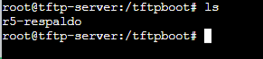

4. Para copiar la configuración se ejecutan los siguientes comando en cualquiera de los routers

    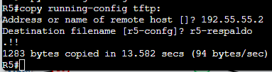

### HTTP
1. Crear una carpeta dentro de nuestra máquina virtual llamada HTTP
2. Crear un archivo llamado Dockerfile dentro de la carpeta que acabamos de crear
3. Pegar la siguiente configuración en el archivo  

    > FROM ubuntu
    RUN apt update  
    ENV TZ=America/Mexico_City  
    RUN ln -snf /usr/share/zoneinfo/$TZ /etc/localtime && echo $TZ > /etc/timezone  
    RUN apt install nano  
    RUN apt install iputils-ping -y  
    RUN apt install iproute2 -y  
    RUN apt install net-tools -y  
    RUN apt install systemctl -y  
    RUN apt install apache2 -y   

4. Crear la imagen con el siguiente comando `sudo docker build -t nueva-imagen .`

    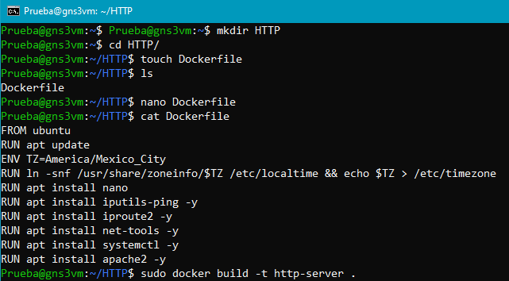

5. Para encender el servidor ejecutamos el comando `systemctl start apache2` desde la consola del cliente de GNS3

6. Para ver el estado del servidor ejecutamos el comando `systemctl status apache2`

    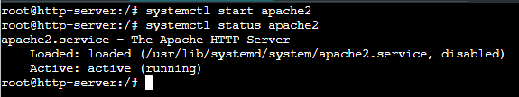

7. Para consultar la página HTML/CSS/JavaScript que apache2 nos arroja debemos utilizar un cliente, en este caso el appliance [Ubuntu docker](https://gns3.com/marketplace/appliances/ubuntu-with-gui) del marketplace de GN3, también se puede encontrar en la carpeta **Recursos** de este repositorio

    - Asignarle una dirección estática o dejar que el servidor **DHCP** lo haga, es indispensable que tenga una dirección ya que sin ella no se podra consultar la página HTML/CSS/JavaScript
    - Desde la terminal del cliente de GNS3 escribir el siguiente comando `curl 192.22.22.2` (esta dirección es nuestro servidor HTTP)

        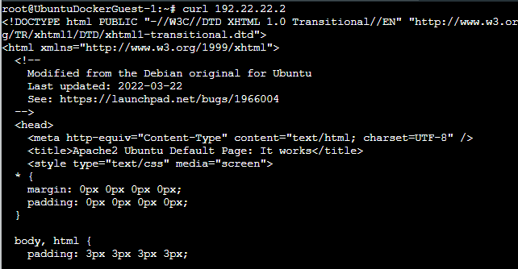

### Guardar la configuración de los servidores

Es necesario guardar la configuración de los servidores, ya que sino se hace al apagar la máquina virtual toda nuestra configuración se borrará

1. Desde el cliente de GNS3 abrir la configuración del servidor

2. En el apartado **Advanced** colocaremos la siguiente lista de directorios en la segunda caja de texto

    > /etc  
    /usr  
    /opt  
    /bin  
    /lib  
    /root  
    /home  

    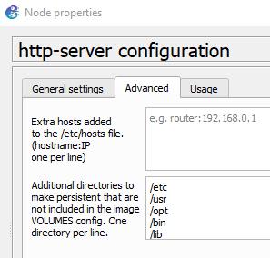

**Para que esta configuración sea exitosa se debe reiniciar el servidor**

## Configuración de VLAN's

Este proceso se realizó usando la interfaz gráfica del cliente de GNS3 y Ethernet switches

1. Abrir la configuración de cualquier switch donde se quiera configurar las VLAN

2. Asignar como puerto **trunk** o **dot1q** al puerto conectado directamente al router

3. Asignar los diferentes puertos a las VLAN deseadas

    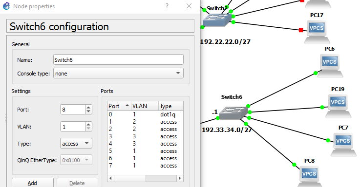

**Este proceso inhabilita a las computadoras o servidores que se encuentran conectados a dicho switch de mantener comunicación con otros nodos de la red**

## Configuración un servidor DHCP en una VPC

1. Abri la terminal de una de las VPC

2. Nos aseguramos que no tenga una IP configurada con el comando `sh ip`

    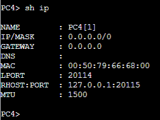

3. Le asignamos un servidor DHCP con el comando `ip dhcp`

    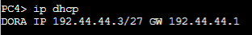

4. Comprobamos la configuración de la VPC con el comando `sh ip`

    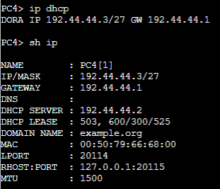

## Configuración un servidor DNS en una VPC

1. Configurar una dirección estática o dinámica (con un servidor DHCP) a la VPC

    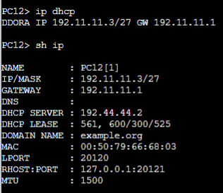

2. Le asignamos un servidor DNs con el comando `ip dns 192.11.11.2` (la ip es de nuestro servidor dns)

    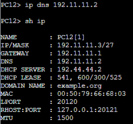

## Configuración de una dirección IPv4 estática en una VPC

1. Abri la terminal de una de las VPC

2. Escribir el siguiente comando `ip (dirección)/(submascara en formato CIDR) (gateway)`

    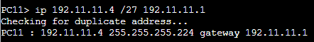

3. Comprobamos la configuración de la VPC con el comando `sh ip`

    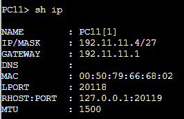

4. Para guardar la configuración usamos el comando `save`

## Comandos Docker
1. Ver los contenedores corriendo: `sudo docker ps`
2. Crear una imagen de docker: `sudo docker build -t nueva_imagen .` 
3. Ver todas las imagenes: `sudo docker images`
4. Usar la terminal el contenedor desde cmd: `sudo docker exec -it [id] bash`  
    
    - id son los tres primeros caracteres de cada contenedor)  
    
        
